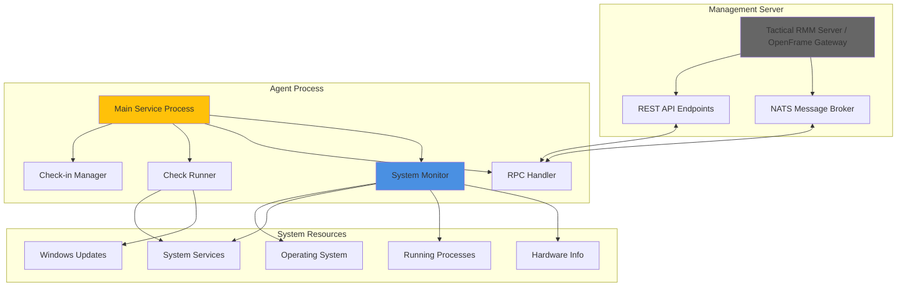

<div align="center">
  <picture>
    <source media="(prefers-color-scheme: dark)" srcset="https://shdrojejslhgnojzkzak.supabase.co/storage/v1/object/public/public/doc-orchestrator/logos/1771558472590-c1pckl-1771371901777-lc3cse-logo-openframe-full-dark-bg.png">
    <source media="(prefers-color-scheme: light)" srcset="https://shdrojejslhgnojzkzak.supabase.co/storage/v1/object/public/public/doc-orchestrator/logos/1771558474818-vusc7-1771372526604-k3y1w-logo-openframe-full-light-bg.png">
    
  </picture>
</div>

<p align="center">
  <a href="LICENSE.md"></a>
</p>

# Tactical RMM Agent

A powerful, cross-platform remote monitoring and management (RMM) agent written in Go that enables enterprise-grade endpoint management across Windows, macOS, and Linux systems. The agent provides real-time system monitoring, remote command execution, automated patch management, and comprehensive device oversight through secure client-server communication.

## Features

- **🔍 Comprehensive System Monitoring**: Real-time collection of CPU usage, memory consumption, disk space, running services, and hardware inventory
- **🚀 Remote Command Execution**: Secure execution of PowerShell, Bash, and Python scripts with sandboxed environments and resource limits
- **📊 Automated Health Checks**: Built-in monitoring for disk space, system performance, network connectivity, and custom script validation
- **🔧 Cross-Platform Service Management**: Native service lifecycle management with start/stop/restart operations across all supported platforms
- **🔐 Enterprise Security**: Token-based authentication with automatic refresh, encrypted HTTPS/NATS communication, and OpenFrame integration
- **📈 Real-Time Communication**: NATS-based messaging for instant command execution and status updates with 35-120 second check-in intervals
- **🖥️ Windows Update Management**: Complete Windows Update integration including patch installation, reboot scheduling, and update history tracking
- **⚙️ Task Scheduling**: Automated maintenance tasks, scheduled operations, and custom job execution with cron-like scheduling

## Technology Stack

- **Language**: Go 1.20+
- **Messaging**: NATS for real-time bidirectional communication
- **HTTP Client**: Resty v2.13+ for REST API communication
- **System Integration**: gopsutil v3 for cross-platform system information
- **Service Management**: kardianos/service for cross-platform service operations
- **Logging**: Logrus for structured logging with multiple output formats
- **Configuration**: Viper for Unix/Linux configuration management

## Quick Start

### Prerequisites

- Supported OS: Windows 7+, macOS 10.13+, Linux (Ubuntu 16.04+, RHEL 7+, Debian 9+)
- Network: Outbound HTTPS (443) and NATS (4222) access to your Tactical RMM server
- Privileges: Administrator (Windows) or root/sudo (Unix/Linux/macOS) for installation

### Installation

**Linux/macOS:**
```bash
# Download and make executable
wget https://your-rmm-server.com/agents/rmmagent
chmod +x rmmagent

# Install with server parameters
sudo ./rmmagent -m install \
  -api "https://your-rmm-server.com" \
  -client-id 1 \
  -site-id 2 \
  -auth "your-installation-token" \
  -desc "Production Server" \
  -agent-type "server"
```

**Windows (PowerShell as Administrator):**
```powershell
# Download and install
Invoke-WebRequest -Uri "https://your-rmm-server.com/agents/rmmagent.exe" -OutFile "rmmagent.exe"
.\rmmagent.exe -m install -api "https://your-rmm-server.com" -client-id 1 -site-id 2 -auth "your-token" -desc "Production Server"
```

### Verification

Check service status:

```bash
# Linux
systemctl status tacticalrmm

# macOS
sudo launchctl list | grep tacticalrmm

# Windows
Get-Service -Name "Tactical RMM Agent"
```

Your agent should appear online in your Tactical RMM web console within 2-3 minutes.

## Architecture

The agent follows a service-oriented architecture with concurrent operations:



### Core Components

| Component | Responsibilities |
|-----------|------------------|
| **Agent Core** | Main service initialization, configuration management, platform-specific implementations |
| **Service Manager** | Service lifecycle, periodic check-ins, task scheduling |
| **RPC Handler** | NATS message processing, remote command execution with security validation |
| **Check System** | Health checks for disk space, CPU, memory, ping, and custom script execution |
| **System Monitor** | Process monitoring, service management, and hardware inventory collection |
| **OpenFrame Integration** | Token management, enhanced security, and connection handling for enterprise deployments |

## CLI Commands

The agent supports multiple operational modes:

### Service Operations
```bash
# Install as system service
tacticalrmm -m installsvc

# Run as service (typically called by service manager)
tacticalrmm -m svc

# Run RPC handler directly (for debugging)
tacticalrmm -m rpc
```

### Installation with OpenFrame Integration
```bash
# Standard installation
tacticalrmm -m install -api "https://rmm.example.com" -auth "token123" \
  -client-id 1 -site-id 1 -agent-type server -desc "Production Server"

# OpenFrame mode
tacticalrmm -m install -openframe-mode -openframe-secret "key" \
  -openframe-token-path "/path/to/token"
```

### Monitoring and Diagnostics
```bash
# Manual operations
tacticalrmm -m checkin          # Force check-in
tacticalrmm -m runchecks        # Run all health checks
tacticalrmm -m software         # Send installed software list
tacticalrmm -pk                 # Show agent primary key
tacticalrmm -agentid           # Show agent ID
```

## Documentation

📚 See the [Documentation](./docs/README.md) for comprehensive guides including:

- **Getting Started**: Prerequisites, quick start, and first steps
- **Development**: Architecture, setup, testing, and contributing guidelines
- **Reference**: Technical specifications and API documentation

## System Requirements

| Platform | Versions | Architecture |
|----------|----------|--------------|
| **Windows** | 7 SP1+, Server 2008 R2+, 10, 11, Server 2016/2019/2022 | x86_64, x86 |
| **macOS** | 10.13 High Sierra and later | x86_64, arm64 (Apple Silicon) |
| **Linux** | Ubuntu 16.04+, RHEL/CentOS 7+, Debian 9+, SUSE 12+, Alpine 3.8+ | x86_64, arm64 |

**Minimum Requirements:**
- CPU: 1 core
- RAM: 512 MB available
- Disk: 100 MB free space
- Network: Persistent internet connection with outbound HTTPS and NATS access

## Security Features

- **Token-Based Authentication**: Secure API access with automatic token refresh
- **Encrypted Communication**: All server communication uses HTTPS and secure NATS messaging
- **Input Validation**: Comprehensive validation and sanitization of all external input
- **Sandboxed Execution**: Command execution in controlled environments with resource limits
- **Privilege Management**: Operates with minimal required system privileges
- **OpenFrame Integration**: Enhanced security for enterprise deployments

## Contributing

We welcome contributions! Please see [CONTRIBUTING.md](./CONTRIBUTING.md) for detailed guidelines on:

- Code style and conventions
- Development workflow and testing
- Pull request process and review standards
- Security best practices

## License

This project is licensed under the Flamingo AI Unified License v1.0. See [LICENSE.md](./LICENSE.md) for details.

---

<div align="center">
  Built with 💛 by the <a href="https://www.flamingo.run/about"><b>Flamingo</b></a> team
</div>