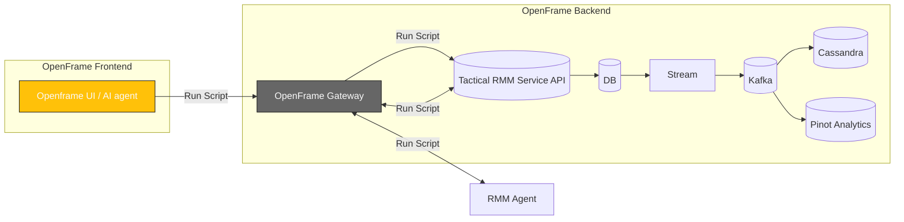

div align="center">
  <picture>
    <!-- Dark theme -->
    <source media="(prefers-color-scheme: dark)" srcset="https://github.com/flamingo-stack/openframe-oss-tenant/blob/d82f21ba18735dac29eb0f3be5d3edf661bb0060/docs/assets/logo-openframe-full-dark-bg.png">
    <!-- Light theme -->
    <source media="(prefers-color-scheme: light)" srcset="https://github.com/flamingo-stack/openframe-oss-tenant/blob/d82f21ba18735dac29eb0f3be5d3edf661bb0060/docs/assets/logo-openframe-full-light-bg.png">
    <!-- Default / fallback -->
    
  </picture>

  <h1>Tactical RMM Agent</h1>

  <p><b>Cross-platform Rust agent for remote monitoring, automation, and secure device management in the OpenFrame ecosystem.</b></p>

  <p>
    <a href="LICENSE.md">
      
    </a>
    <a href="https://www.flamingo.run/knowledge-base">
      
    </a>
    <a href="https://www.openmsp.ai/">
      
    </a>
  </p>
</div>

---

## Quick Links
- [Overview](#overview)  
- [Quick Start](#quick-start)  
- [Architecture](#architecture)  
- [Security](#security)  
- [Contributing](#contributing)

---

## Overview

**Tactical RMM Agent** is a powerful cross-platform remote monitoring and management agent designed for secure device management and automation. Originally part of the Tactical RMM project, it has been enhanced and integrated into the OpenFrame ecosystem to provide enterprise-grade monitoring and management capabilities.

The agent enables:
- **System Monitoring** - Real-time tracking of CPU, memory, disk, services, and processes
- **Remote Execution** - Run commands, scripts, and automate tasks across your fleet
- **Service Management** - Start, stop, restart services remotely
- **Package Deployment** - Deploy software and updates seamlessly
- **Event Collection** - Gather system events for security and compliance
- **Automated Remediation** - Execute automated responses to system events

In OpenFrame, the Tactical RMM Agent provides the foundation for remote device management, integrating with Fleet for comprehensive endpoint visibility and control.

**Official Tactical RMM Documentation:** [docs.tacticalrmm.com](https://docs.tacticalrmm.com/)  
**GitHub Repository:** [github.com/amidaware/tacticalrmm](https://github.com/amidaware/tacticalrmm)

---

## Highlights

- System Monitoring – CPU, memory, disk, services, processes  
- Remote Execution – commands, service restart, package deployment  
- Secure Communication – gRPC/WebSocket over TLS with JWT  
- Automatic Updates – Velopack-based, zero-downtime  
- Cross-Platform – Windows, macOS, Linux  
- Extensible – collectors and plugins  
- **Integrated installation** through OpenFrame UI - no manual setup required

---

## Architecture

The RMM Agent runs locally on endpoints and connects securely to OpenFrame Gateway:



## Quick Start

### Prerequisites

**No manual compilation required!** The Tactical RMM Agent is automatically deployed through OpenFrame's device enrollment process.

Requirements:
- OpenFrame instance running with Tactical RMM service enabled
- Access to OpenFrame UI
- Supported operating system on target endpoints:
  - **Linux:** Ubuntu 20.04+, Debian 11+, CentOS 8+, RHEL 8+
  - **macOS:** 10.15+ (Catalina and later)
  - **Windows:** Windows 10, Windows Server 2016+

### Installation

1. **Log in to OpenFrame UI**

2. **Navigate to the Devices tab**
   - Click on **"Devices"** in the left sidebar
   - Click **"Add Device"** or **"Enroll New Device"** button

3. **Get the installation link**
   - OpenFrame will generate a unique enrollment link/script for your device
   - This link contains:
     - Tactical RMM Agent installer
     - Your OpenFrame server configuration
     - Enrollment credentials for secure authentication
     - Fleet agent integration (includes Osquery)

4. **Run the installation on your endpoint**
   
   **For Linux/macOS:**
   ```bash
   # The UI will provide a command similar to:
   curl -sSL https://your-openframe-instance.com/api/v1/fleet/enroll?token=xxx | sudo bash
   ```

   **For Windows (PowerShell as Administrator):**
   ```powershell
   # The UI will provide a command similar to:
   Invoke-WebRequest -Uri "https://your-openframe-instance.com/api/v1/fleet/enroll?token=xxx" -UseBasicParsing | Invoke-Expression
   ```

5. **Verify installation**
   - Return to the **Devices** tab in OpenFrame UI
   - Your newly enrolled device should appear within 30-60 seconds
   - Status should show as **"Online"**
   - The RMM Agent will begin reporting system metrics immediately

### Running Your First Script

Once your device is enrolled:

1. **Navigate to your device** in the OpenFrame UI
2. **Go to the "Scripts" tab** or use the **AI Agent** interface
3. **Select a pre-defined script** or **write your own**
4. **Execute the script** and view real-time results directly in the UI

For more information on script execution and automation, visit the [Tactical RMM Documentation](https://docs.tacticalrmm.com/).

---

## Security

- TLS 1.3 enforced for all communication  
- OAuth2/OIDC → JWT for authentication (via Gateway)  
- Supports authentication via token or key  
- Minimal client-side privileges required  
- Safeguards against unsafe command execution  
- Least privilege mode on endpoints  

Found a vulnerability? Email **security@flamingo.run** instead of opening a public issue.  

---

## Compatibility Notes

- Inspired by and compatible with the **Tactical RMM Agent**  
- Supports similar build patterns (`go build` with `GOOS`/`GOARCH`)  
- Extended with OpenFrame integration:  
  - Kafka & Pinot streaming pipeline  
  - Unified API layer with OpenFrame Gateway  
  - Multi-tenant security and advanced monitoring  

---

## Contributing

We welcome PRs! Please follow these guidelines:  

- Use branching strategy: `feature/...`, `bugfix/...`  
- Add descriptions to the **CHANGELOG**  
- Follow consistent code style (`cargo fmt` for Rust, `go fmt` + linters for Go)  
- Keep documentation updated in `docs/`  

---

## License

This project is licensed under the **Flamingo Unified License v1.0** ([LICENSE.md](LICENSE.md)).

---

<div align="center">
  <table border="0" cellspacing="0" cellpadding="0">
    <tr>
      <td align="center">
        Built with 💛 by the <a href="https://www.flamingo.run/about"><b>Flamingo</b></a> team
      </td>
      <td align="center">
        <a href="https://www.flamingo.run">Website</a> • 
        <a href="https://www.flamingo.run/knowledge-base">Knowledge Base</a> • 
        <a href="https://www.linkedin.com/showcase/openframemsp/about/">LinkedIn</a> • 
        <a href="https://www.openmsp.ai/">Community</a>
      </td>
    </tr>
  </table>
</div>
