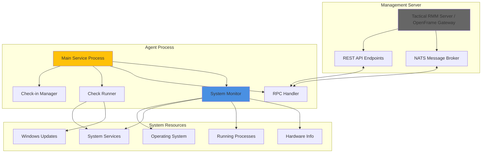
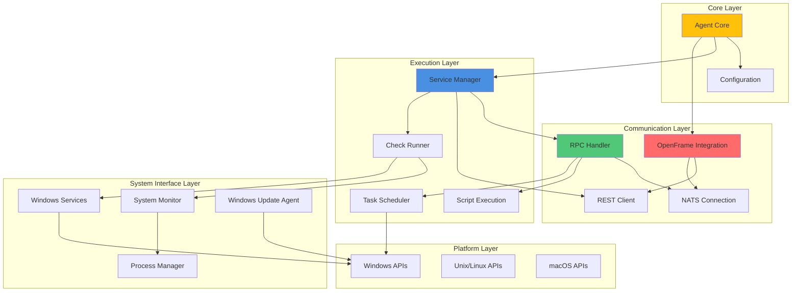
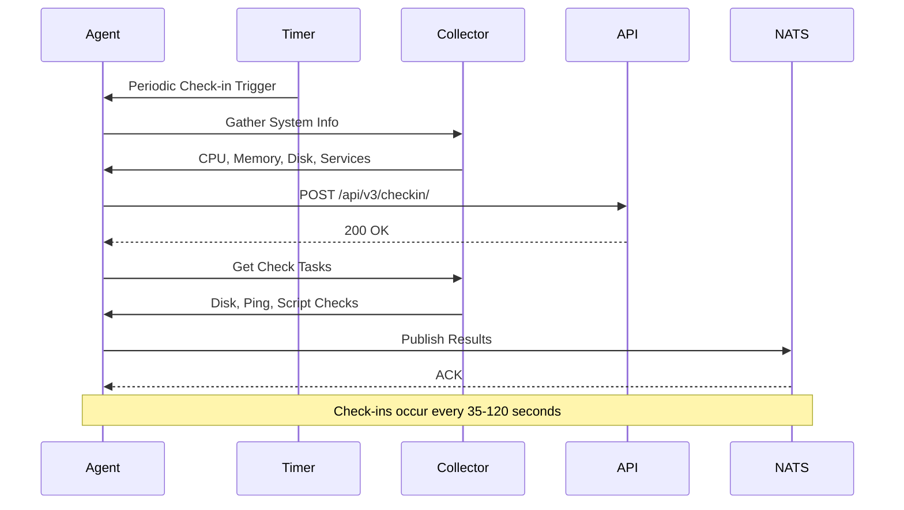
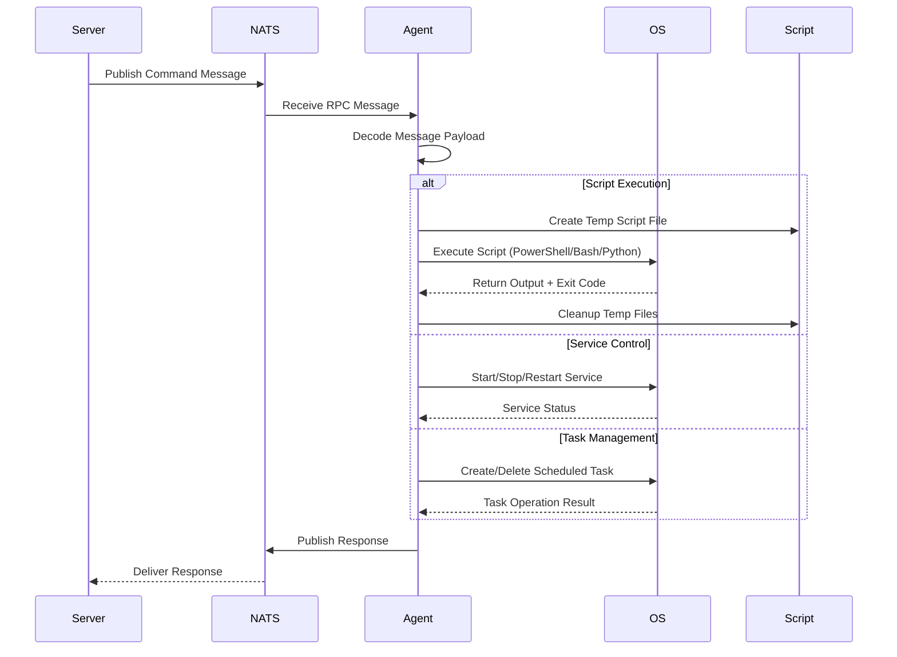

# rmmagent Module Documentation

# Tactical RMM Agent Architecture Documentation

## Overview

The Tactical RMM Agent is a cross-platform remote monitoring and management agent written in Go that provides real-time system monitoring, remote command execution, and automated device management. It operates as a secure client that connects to a Tactical RMM server (or OpenFrame ecosystem) to enable enterprise-grade endpoint management across Windows, macOS, and Linux systems.

## Architecture

The agent follows a service-oriented architecture with a primary event loop that handles multiple concurrent responsibilities including system monitoring, check execution, and bidirectional communication with the management server.

### High-Level System Architecture



## Core Components

| Component | File(s) | Responsibilities |
|-----------|---------|------------------|
| **Agent Core** | `agent/agent.go`, `agent/agent_*.go` | Main agent initialization, configuration, platform-specific implementations |
| **Service Manager** | `agent/svc.go` | Service lifecycle, periodic check-ins, task scheduling |
| **RPC Handler** | `agent/rpc.go` | NATS message processing, remote command execution |
| **Check System** | `agent/checks.go` | Health checks, disk space, CPU, memory, ping, script execution |
| **System Monitor** | `agent/process.go`, `agent/services_windows.go` | Process monitoring, Windows service management |
| **Installation** | `agent/install*.go` | Agent deployment, configuration setup |
| **Updates & Patches** | `agent/patches_windows.go`, `agent/wua_windows.go` | Windows Update management, patch installation |
| **Task Scheduler** | `agent/tasks_windows.go` | Windows scheduled task creation and management |
| **OpenFrame Integration** | `agent/openframe_*.go` | Token management, connection handling for OpenFrame mode |

## Component Relationships



## Data Flow

The agent operates through multiple concurrent data flows for different operational aspects:

### System Monitoring and Check-in Flow



### Remote Command Execution Flow



## Key Files

| File | Purpose |
|------|---------|
| `main.go` | Entry point, CLI argument parsing, service initialization |
| `agent/agent.go` | Core agent struct, initialization, cross-platform base functionality |
| `agent/agent_windows.go` | Windows-specific implementations (registry, services, scripts) |
| `agent/agent_unix.go` | Unix/Linux/macOS implementations (config files, system calls) |
| `agent/rpc.go` | NATS message handling, remote procedure call processing |
| `agent/svc.go` | Service lifecycle management, periodic tasks, check-in scheduling |
| `agent/checks.go` | Health check system (disk, CPU, memory, ping, custom scripts) |
| `agent/install.go` | Agent installation logic, server communication during setup |
| `agent/wua_windows.go` | Windows Update Agent COM interface integration |
| `agent/openframe_connection_manager.go` | OpenFrame token refresh and connection management |
| `shared/types.go` | Data structures shared between agent components |

## Dependencies

The agent leverages several external libraries for core functionality:

| Dependency | Purpose | Key Usage |
|------------|---------|-----------|
| `github.com/nats-io/nats.go` | NATS messaging | Real-time bidirectional communication with server |
| `github.com/go-resty/resty/v2` | HTTP client | REST API calls for check-ins, updates, configuration |
| `github.com/shirou/gopsutil/v3` | System information | CPU usage, memory stats, disk space, process monitoring |
| `github.com/kardianos/service` | Cross-platform service | Service installation, lifecycle management across OS |
| `github.com/go-ole/go-ole` | Windows COM | Windows Update Agent, WMI queries, system management |
| `github.com/sirupsen/logrus` | Structured logging | Debug output, error tracking, operational monitoring |
| `github.com/amidaware/taskmaster` | Windows tasks | Scheduled task creation and management |
| `github.com/elastic/go-sysinfo` | System detection | Host information, OS details, hardware enumeration |
| `github.com/spf13/viper` | Configuration | Unix/Linux config file parsing and management |

## CLI Commands

The agent supports multiple operational modes through command-line flags:

### Service Operations

```bash
# Install as system service
tacticalrmm -m installsvc

# Run as service (typically called by service manager)
tacticalrmm -m svc

# Run RPC handler directly (for debugging)
tacticalrmm -m rpc
```

### Installation

```bash
# Install agent with server connection
tacticalrmm -m install -api "https://rmm.example.com" -auth "token123" \
  -client-id 1 -site-id 1 -agent-type server -desc "Production Server"

# Install with OpenFrame integration
tacticalrmm -m install -openframe-mode -openframe-secret "key" \
  -openframe-token-path "/path/to/token"
```

### Monitoring and Diagnostics

```bash
# Manual check-in to server
tacticalrmm -m checkin

# Run all health checks immediately
tacticalrmm -m runchecks

# Get system information
tacticalrmm -m software      # Send installed software list
tacticalrmm -m publicip      # Display public IP address
tacticalrmm -pk             # Show agent primary key
tacticalrmm -agentid        # Show agent ID
```

### Maintenance

```bash
# Run database migrations
tacticalrmm -m runmigrations

# Clean up old agent update files
tacticalrmm -m cleanup

# Recover mesh agent connection
tacticalrmm -m recovermesh
```

### Platform-Specific Commands

```bash
# Windows: Install Python runtime
tacticalrmm -m getpython

# Unix: Get mesh node ID
tacticalrmm -m nixmeshnodeid

# macOS: Fix mesh installation issues
tacticalrmm -m macventurafix
```

### Task Execution

```bash
# Execute specific task by primary key
tacticalrmm -m taskrunner -p 123
```

### Configuration Options

```bash
# Set logging level and output
tacticalrmm -log DEBUG -logto file

# Use HTTP proxy
tacticalrmm -proxy "http://proxy.example.com:8080"

# Allow insecure connections (testing only)
tacticalrmm -insecure

# Custom NATS port
tacticalrmm -natsport "4222"
```
