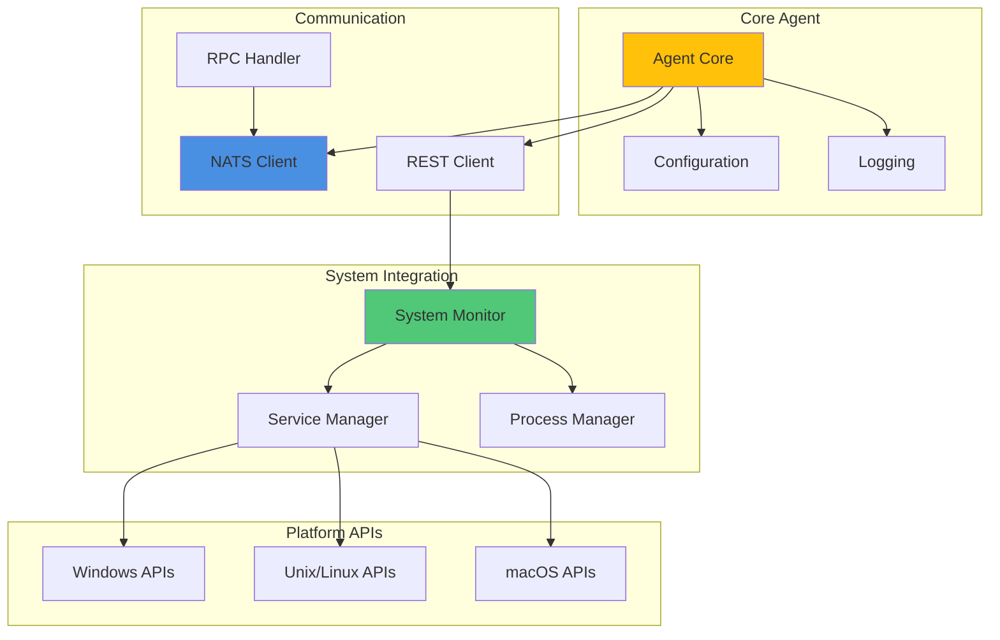

# Development Documentation

Welcome to the Tactical RMM Agent development documentation. This section provides comprehensive guides for developers who want to contribute to, extend, or understand the internal workings of the Tactical RMM Agent.

## Overview

The Tactical RMM Agent is a cross-platform remote monitoring and management agent written in Go, designed for enterprise-grade endpoint management. The codebase emphasizes security, performance, and cross-platform compatibility with native integrations for Windows, macOS, and Linux systems.

## Documentation Structure

This development section is organized into focused areas to help you quickly find the information you need:

### 🛠️ **Setup Guides**
- **[Environment Setup](setup/environment.md)** - IDE configuration, development tools, and editor extensions
- **[Local Development](setup/local-development.md)** - Clone, build, run, and debug the agent locally

### 🏗️ **Architecture**
- **[Architecture Overview](architecture/README.md)** - System design, component relationships, and data flow diagrams

### 🔒 **Security**
- **[Security Best Practices](security/README.md)** - Authentication, encryption, secure coding, and vulnerability mitigation

### 🧪 **Testing**  
- **[Testing Guide](testing/README.md)** - Test structure, running tests, writing new tests, and coverage requirements

### 🤝 **Contributing**
- **[Contributing Guidelines](contributing/guidelines.md)** - Code style, PR process, commit conventions, and review checklist

## Technology Stack

The Tactical RMM Agent is built with modern Go development practices and cross-platform libraries:

### Core Technologies

| Technology | Version | Purpose |
|------------|---------|---------|
| **Go** | 1.20+ | Primary programming language |
| **NATS** | 1.36.0+ | Real-time messaging and RPC communication |
| **Resty** | 2.13.1+ | HTTP client for REST API communication |
| **Logrus** | 1.9.3+ | Structured logging |
| **Viper** | 1.19.0+ | Configuration management |

### Platform-Specific Libraries

| Platform | Library | Purpose |
|----------|---------|---------|
| **Windows** | go-win64api, wmi, gonutz/w32 | Windows API access, WMI queries, system integration |
| **Cross-platform** | gopsutil, go-sysinfo | System information and process management |
| **Service Management** | kardianos/service | Cross-platform service installation and management |
| **Network** | go-ping | Network connectivity testing |

### Dependencies Overview



## Development Workflow

### Quick Start for Developers

1. **[Environment Setup](setup/environment.md)** - Configure your development environment
2. **[Local Development](setup/local-development.md)** - Clone and build the project  
3. **[Architecture Overview](architecture/README.md)** - Understand the system design
4. **[Contributing Guidelines](contributing/guidelines.md)** - Review coding standards

### Typical Development Tasks

| Task | Documentation |
|------|---------------|
| **Set up development environment** | [Environment Setup](setup/environment.md) |
| **Build and run locally** | [Local Development](setup/local-development.md) |
| **Understand component relationships** | [Architecture Overview](architecture/README.md) |
| **Add new system checks** | [Architecture Overview](architecture/README.md) |
| **Implement platform-specific features** | [Architecture Overview](architecture/README.md) |
| **Write and run tests** | [Testing Guide](testing/README.md) |
| **Submit code changes** | [Contributing Guidelines](contributing/guidelines.md) |

## Key Development Concepts

### Cross-Platform Architecture

The agent uses Go's build constraints and interface-based design to provide platform-specific implementations:

```go
// agent_windows.go - Windows-specific implementation
//go:build windows

func (a *Agent) platformSpecificInit() error {
    // Windows-specific initialization
}

// agent_unix.go - Unix/Linux-specific implementation  
//go:build !windows

func (a *Agent) platformSpecificInit() error {
    // Unix/Linux-specific initialization
}
```

### Service-Oriented Design

The agent follows a service-oriented architecture with concurrent goroutines handling different responsibilities:

- **Main Service Loop**: Coordinates all agent operations
- **Check-in Manager**: Handles periodic server communication
- **RPC Handler**: Processes real-time commands via NATS
- **System Monitor**: Collects system metrics and health data
- **Task Scheduler**: Manages automated maintenance tasks

### Security-First Approach

Security considerations are built into every component:

- **Token-based Authentication**: Secure API access with automatic token refresh
- **Encrypted Communication**: All server communication uses HTTPS and secure NATS
- **Input Validation**: All external input is validated and sanitized
- **Privilege Management**: Minimal required privileges for operation
- **Secure Logging**: Sensitive information is never logged

## Common Development Patterns

### Error Handling

```go
// Consistent error handling pattern
func (a *Agent) performOperation() error {
    if err := a.validateInput(); err != nil {
        a.Logger.WithError(err).Error("Input validation failed")
        return fmt.Errorf("operation failed: %w", err)
    }
    
    if err := a.executeOperation(); err != nil {
        a.Logger.WithError(err).Error("Operation execution failed")
        return fmt.Errorf("execution failed: %w", err)
    }
    
    a.Logger.Info("Operation completed successfully")
    return nil
}
```

### Platform Detection

```go
// Runtime platform detection
func (a *Agent) getPlatformInfo() PlatformInfo {
    return PlatformInfo{
        OS:   runtime.GOOS,
        Arch: runtime.GOARCH,
        Platform: a.Platform, // "windows", "linux", "darwin"
    }
}
```

### Concurrent Operations

```go
// Concurrent task execution pattern
func (a *Agent) runConcurrentChecks(ctx context.Context) error {
    var wg sync.WaitGroup
    errChan := make(chan error, len(a.Checks))
    
    for _, check := range a.Checks {
        wg.Add(1)
        go func(c Check) {
            defer wg.Done()
            if err := c.Execute(ctx); err != nil {
                errChan <- err
            }
        }(check)
    }
    
    wg.Wait()
    close(errChan)
    
    for err := range errChan {
        a.Logger.WithError(err).Error("Check execution failed")
    }
    
    return nil
}
```

## Getting Started

If you're new to the codebase, we recommend this learning path:

1. **Read the [Architecture Overview](architecture/README.md)** to understand the system design
2. **Set up your [Development Environment](setup/environment.md)** with proper tooling
3. **Follow the [Local Development Guide](setup/local-development.md)** to build and run the agent
4. **Review [Security Practices](security/README.md)** to understand security requirements
5. **Examine the [Testing Strategy](testing/README.md)** and run the test suite
6. **Study [Contributing Guidelines](contributing/guidelines.md)** before making changes

## Community and Support

### Development Resources

- **Source Code**: github.com/amidaware/rmmagent
- **Go Documentation**: golang.org/doc/
- **NATS Documentation**: docs.nats.io/
- **Cross-platform Development**: Go build constraints and runtime package

### Best Practices

- Write platform-agnostic code when possible
- Use build constraints for platform-specific functionality
- Include comprehensive error handling and logging
- Write tests for all new functionality
- Follow Go naming conventions and code organization
- Document public APIs and complex algorithms

Start with the [Environment Setup](setup/environment.md) guide to configure your development environment and begin contributing to the Tactical RMM Agent project.