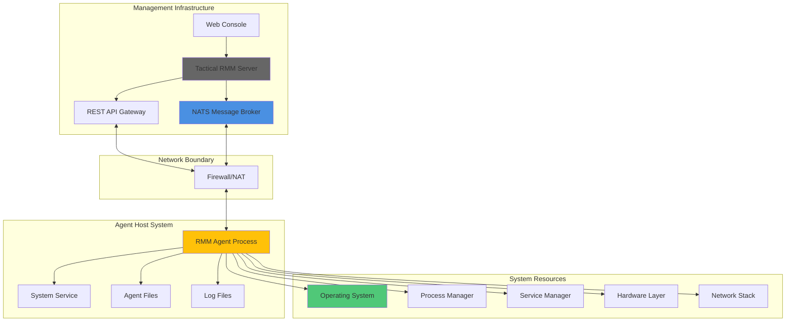
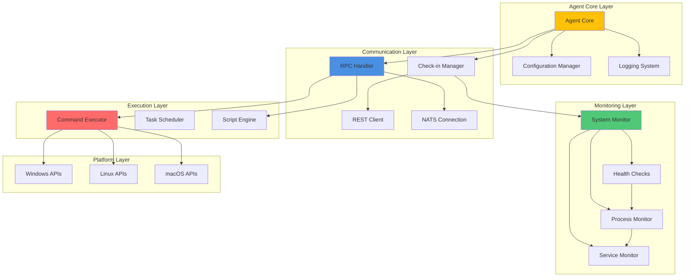
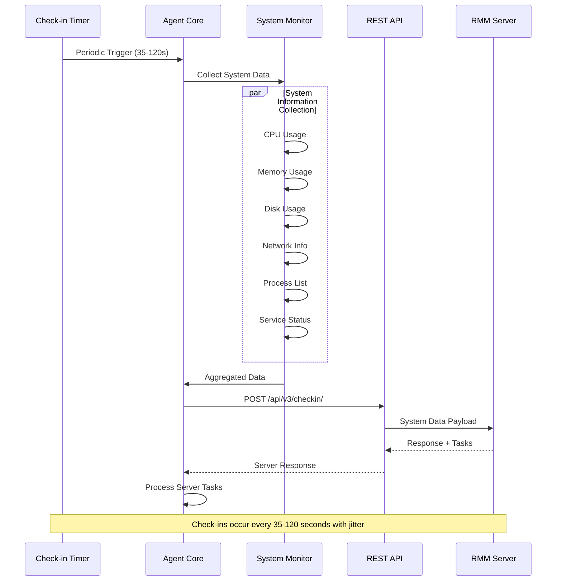
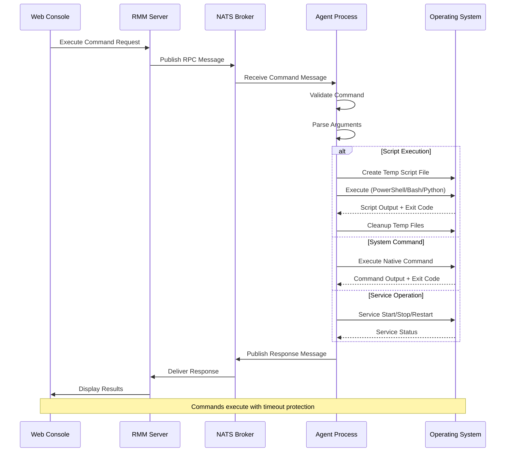
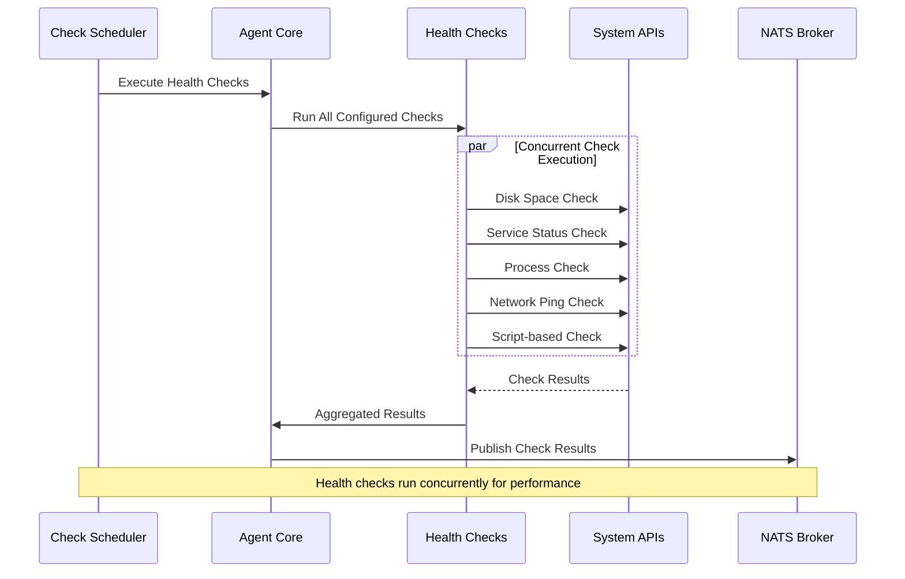
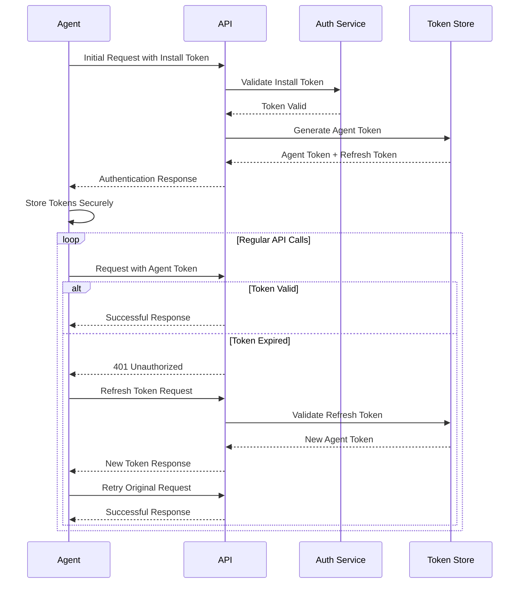

# Architecture Overview

This document provides a comprehensive view of the Tactical RMM Agent's architecture, including system design patterns, component relationships, data flow diagrams, and key architectural decisions that shape the codebase.

## High-Level Architecture

The Tactical RMM Agent is designed as a cross-platform, service-oriented application that bridges managed endpoints with a central management server. It operates through concurrent subsystems that handle different aspects of system monitoring and remote management.



## Core Components

The agent architecture consists of six primary components, each responsible for specific functionality while maintaining loose coupling through well-defined interfaces.

### Component Overview Table

| Component | Files | Primary Responsibilities |
|-----------|-------|-------------------------|
| **Agent Core** | `agent.go`, `agent_*.go` | Service lifecycle, configuration management, platform abstraction |
| **Communication** | `rpc.go`, `checkin.go` | NATS messaging, REST API communication, server synchronization |
| **System Monitoring** | `checks.go`, `process.go` | Health checks, performance metrics, system state collection |
| **Command Execution** | `rpc.go`, `agent.go` | Remote command processing, script execution, task management |
| **Platform Services** | `services_windows.go`, `install_*.go` | OS-specific integrations, service management, installation |
| **Security & Auth** | `openframe_*.go`, `agent.go` | Authentication, token management, secure communication |

### Core Component Relationships



## Data Flow Architecture

The agent operates through multiple concurrent data flows that handle different operational aspects without blocking each other.

### Primary Data Flows

#### 1. System Monitoring and Check-in Flow



#### 2. Real-Time Command Execution Flow



#### 3. Health Check Execution Flow



## Key Design Decisions

### 1. Cross-Platform Architecture Strategy

**Decision**: Use Go build tags and interface-based design for platform-specific functionality.

**Implementation Pattern**:
```go
// agent.go - Common interface and base functionality
type PlatformAgent interface {
    InstallService() error
    GetSystemInfo() SystemInfo
    ManageProcesses() ProcessList
}

// agent_windows.go
//go:build windows
func (a *Agent) InstallService() error {
    // Windows-specific service installation
    return installWindowsService()
}

// agent_unix.go  
//go:build !windows
func (a *Agent) InstallService() error {
    // Unix/Linux service installation
    return installSystemdService()
}
```

**Benefits**:
- Single codebase for all platforms
- Platform-optimized implementations
- Compile-time platform selection
- Simplified maintenance and testing

### 2. Concurrent Service Architecture

**Decision**: Use goroutines for concurrent operations with structured concurrency patterns.

**Implementation Pattern**:
```go
func (a *Agent) startConcurrentServices(ctx context.Context) error {
    var wg sync.WaitGroup
    errChan := make(chan error, 3)
    
    // Check-in service
    wg.Add(1)
    go func() {
        defer wg.Done()
        if err := a.runCheckinLoop(ctx); err != nil {
            errChan <- fmt.Errorf("checkin failed: %w", err)
        }
    }()
    
    // RPC service
    wg.Add(1) 
    go func() {
        defer wg.Done()
        if err := a.runRPCHandler(ctx); err != nil {
            errChan <- fmt.Errorf("rpc failed: %w", err)
        }
    }()
    
    // Health checks
    wg.Add(1)
    go func() {
        defer wg.Done()
        if err := a.runHealthChecks(ctx); err != nil {
            errChan <- fmt.Errorf("health checks failed: %w", err)
        }
    }()
    
    wg.Wait()
    close(errChan)
    
    // Handle errors
    for err := range errChan {
        a.Logger.WithError(err).Error("Service error")
    }
    
    return nil
}
```

**Benefits**:
- Non-blocking operations
- Independent service failures don't crash entire agent
- Efficient resource utilization
- Responsive command execution

### 3. Security-First Communication

**Decision**: All external communication uses encryption with token-based authentication.

**Architecture Components**:
- **HTTPS REST API**: All HTTP communication over TLS
- **Secure NATS**: TLS-encrypted real-time messaging
- **Token Management**: Automatic token refresh with secure storage
- **Input Validation**: All external input validated and sanitized

### 4. Event-Driven Check-in System

**Decision**: Use adaptive timing for server communication to balance responsiveness and resource usage.

**Timing Strategy**:
```go
type CheckinScheduler struct {
    BaseInterval    time.Duration // 35 seconds
    MaxInterval     time.Duration // 120 seconds  
    Jitter          time.Duration // Random variance
    BackoffFactor   float64       // Exponential backoff
}

func (c *CheckinScheduler) nextCheckinTime() time.Duration {
    base := c.BaseInterval
    if c.hasErrors {
        base = time.Duration(float64(base) * c.BackoffFactor)
    }
    
    jitter := time.Duration(rand.Int63n(int64(c.Jitter)))
    return base + jitter
}
```

**Benefits**:
- Reduces server load with jitter
- Adaptive behavior under error conditions
- Maintains responsiveness
- Network-friendly timing

## Component Deep Dive

### Agent Core (`agent.go`)

The Agent Core serves as the central orchestrator and provides the main Agent struct that contains all configuration, connections, and state.

**Key Responsibilities**:
- Service lifecycle management
- Configuration loading and validation
- HTTP client initialization
- NATS connection management
- Platform detection and setup
- Cross-platform abstraction layer

**Core Data Structures**:
```go
type Agent struct {
    // Configuration
    BaseURL    string
    ApiURL     string
    Token      string
    AgentID    string
    
    // Communication
    HTTPClient *http.Client
    NatsConn   *nats.Conn
    
    // Platform info
    Platform   string
    GoArch     string
    
    // Logging
    Logger     *logrus.Logger
    
    // State
    ctx        context.Context
    cancel     context.CancelFunc
}
```

### RPC Handler (`rpc.go`)

Manages real-time bidirectional communication via NATS messaging for immediate command execution and responses.

**Message Types Handled**:
- Command execution requests
- Script deployment and execution
- System operation commands (reboot, service control)
- File transfer operations
- Configuration updates

**Security Features**:
- Message payload encryption
- Command validation and sanitization
- Execution timeout protection
- Resource usage limits

### System Monitor (`checks.go`, `process.go`)

Continuously collects system metrics and executes health checks to maintain system oversight.

**Monitoring Categories**:

| Category | Metrics Collected |
|----------|------------------|
| **System Resources** | CPU usage, memory usage, disk space, network I/O |
| **Process Monitoring** | Running processes, CPU/memory per process, process trees |
| **Service Status** | Service states, startup types, dependencies |
| **Network Health** | Connectivity tests, DNS resolution, latency measurements |
| **Security Status** | Windows Defender status, firewall state, update compliance |

### Platform Services

Platform-specific integrations provide native OS functionality while maintaining a consistent interface.

**Windows Platform** (`*_windows.go`):
- Windows Management Instrumentation (WMI) queries
- Windows Update Agent integration
- Service Control Manager operations
- Registry access and modification
- Event log management
- PowerShell script execution

**Unix/Linux Platform** (`*_unix.go`):
- systemd service management
- Process control via signal handling
- Package manager integration
- Shell script execution
- Log file monitoring

**macOS Platform** (`*_darwin.go`):
- launchd service management
- macOS-specific system information
- Security framework integration
- Application management

## Performance Considerations

### Memory Management

- **Connection Pooling**: HTTP client reuses connections
- **Buffer Management**: Limited buffer sizes for command output
- **Garbage Collection**: Periodic cleanup of temporary files and data
- **Memory Monitoring**: Self-monitoring of agent memory usage

### CPU Optimization

- **Efficient Polling**: Adaptive check-in intervals reduce CPU overhead
- **Concurrent Execution**: Non-blocking operations prevent CPU starvation
- **Platform-Specific Optimizations**: Native API usage minimizes overhead

### Network Efficiency

- **Batched Operations**: Multiple checks sent in single API calls
- **Compression**: HTTP response compression where supported
- **Connection Management**: Persistent connections reduce handshake overhead

## Scalability Architecture

### Horizontal Scalability

The agent is designed to handle large-scale deployments:

- **Stateless Design**: Agent state is minimal and recoverable
- **Independent Operation**: Agents operate independently without inter-agent communication
- **Graceful Degradation**: Agent continues operating with limited connectivity

### Resource Scaling

- **Adaptive Resource Usage**: Agent adjusts resource consumption based on system load
- **Configurable Limits**: Memory, CPU, and network usage limits are configurable
- **Priority-Based Execution**: Critical operations prioritized over routine tasks

## Security Architecture

### Authentication Flow



### Data Protection

- **In-Transit Encryption**: All network communication encrypted with TLS
- **At-Rest Protection**: Sensitive data encrypted on disk
- **Memory Protection**: Sensitive data cleared from memory after use
- **Access Controls**: File system permissions restrict access to agent files

## Error Handling and Resilience

### Failure Recovery Patterns

```go
// Exponential backoff with jitter
func (a *Agent) retryWithBackoff(operation func() error) error {
    backoff := time.Second
    maxBackoff := 5 * time.Minute
    
    for attempt := 0; attempt < maxRetries; attempt++ {
        if err := operation(); err == nil {
            return nil
        }
        
        // Add jitter to prevent thundering herd
        jitter := time.Duration(rand.Int63n(int64(backoff)))
        time.Sleep(backoff + jitter)
        
        backoff = time.Duration(float64(backoff) * 1.5)
        if backoff > maxBackoff {
            backoff = maxBackoff
        }
    }
    
    return fmt.Errorf("operation failed after %d attempts", maxRetries)
}
```

### Circuit Breaker Pattern

- **Network Operations**: Circuit breakers prevent cascade failures
- **Resource Protection**: Automatic throttling under high load
- **Service Isolation**: Component failures don't impact entire system

## Testing Architecture

### Test Organization

```text
tests/
├── unit/           # Unit tests for individual components
├── integration/    # Integration tests for component interaction
├── platform/       # Platform-specific test suites
├── performance/    # Performance and load tests
└── security/       # Security and penetration tests
```

### Testing Strategies

- **Mock Dependencies**: External dependencies mocked for unit tests
- **Test Doubles**: Interface-based testing with test implementations
- **Platform Testing**: Automated testing across supported platforms
- **Load Testing**: Performance testing under various load conditions

This architecture provides a solid foundation for a scalable, secure, and maintainable cross-platform remote management agent. The design patterns and decisions documented here guide both current development and future enhancements to the system.