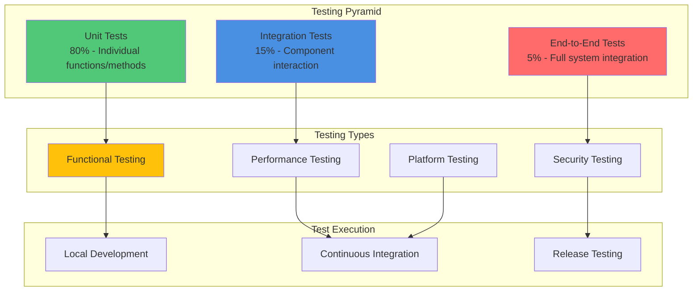

# Testing Guide

This document provides comprehensive guidance on the testing strategy, structure, and practices for the Tactical RMM Agent. It covers unit testing, integration testing, platform-specific testing, and performance testing approaches.

## Testing Strategy Overview

The Tactical RMM Agent employs a multi-layered testing strategy to ensure reliability, security, and performance across all supported platforms.

### Testing Pyramid



## Test Structure and Organization

### Directory Structure

The test suite is organized to mirror the source code structure while separating different types of tests:

```text
rmmagent/
├── agent/
│   ├── agent.go
│   ├── agent_test.go          # Unit tests for agent.go
│   ├── agent_windows_test.go  # Windows-specific unit tests
│   ├── agent_unix_test.go     # Unix-specific unit tests
│   ├── checks.go
│   ├── checks_test.go         # Unit tests for checks.go
│   └── ...
├── tests/
│   ├── integration/           # Integration test suites
│   │   ├── agent_server_test.go
│   │   ├── nats_communication_test.go
│   │   └── system_monitor_test.go
│   ├── platform/              # Platform-specific integration tests
│   │   ├── windows_service_test.go
│   │   ├── linux_systemd_test.go
│   │   └── macos_launchd_test.go
│   ├── performance/           # Performance and load tests
│   │   ├── benchmarks_test.go
│   │   └── load_test.go
│   ├── security/              # Security-focused tests
│   │   ├── auth_test.go
│   │   ├── injection_test.go
│   │   └── encryption_test.go
│   └── testdata/              # Test fixtures and data
│       ├── configs/
│       ├── scripts/
│       └── responses/
├── mocks/                     # Generated mocks
│   ├── mock_agent.go
│   └── mock_nats.go
└── go.mod
```

## Unit Testing

Unit tests form the foundation of the testing strategy, providing fast feedback and high coverage of individual components.

### Unit Test Standards

**Test File Naming Convention:**
- Test files follow the pattern `*_test.go`
- Platform-specific tests use `*_windows_test.go`, `*_unix_test.go`, `*_darwin_test.go`
- Test function names use `TestFunctionName` pattern

### Example Unit Test Structure

```go
package agent

import (
    "context"
    "testing"
    "time"
    
    "github.com/stretchr/testify/assert"
    "github.com/stretchr/testify/require"
    "github.com/stretchr/testify/mock"
)

func TestAgentInitialization(t *testing.T) {
    tests := []struct {
        name        string
        config      Config
        wantErr     bool
        expectedMsg string
    }{
        {
            name: "valid_config",
            config: Config{
                BaseURL:  "https://test.example.com",
                Token:    "valid-token",
                ClientID: 1,
                SiteID:   1,
            },
            wantErr: false,
        },
        {
            name: "missing_baseurl",
            config: Config{
                Token:    "valid-token",
                ClientID: 1,
                SiteID:   1,
            },
            wantErr:     true,
            expectedMsg: "baseurl is required",
        },
        {
            name: "invalid_token",
            config: Config{
                BaseURL:  "https://test.example.com",
                Token:    "",
                ClientID: 1,
                SiteID:   1,
            },
            wantErr:     true,
            expectedMsg: "token is required",
        },
    }
    
    for _, tt := range tests {
        t.Run(tt.name, func(t *testing.T) {
            agent, err := NewAgent(tt.config)
            
            if tt.wantErr {
                assert.Error(t, err)
                if tt.expectedMsg != "" {
                    assert.Contains(t, err.Error(), tt.expectedMsg)
                }
                assert.Nil(t, agent)
            } else {
                assert.NoError(t, err)
                assert.NotNil(t, agent)
                assert.Equal(t, tt.config.BaseURL, agent.BaseURL)
            }
        })
    }
}

func TestCommandExecution(t *testing.T) {
    agent := &Agent{
        Logger: newTestLogger(),
        Platform: "linux",
    }
    
    tests := []struct {
        name           string
        command        Command
        mockSetup      func(*MockExecutor)
        expectedResult *CommandResult
        expectedError  string
    }{
        {
            name: "successful_command",
            command: Command{
                Script:  "echo 'hello world'",
                Shell:   "bash",
                Timeout: 30 * time.Second,
            },
            mockSetup: func(m *MockExecutor) {
                m.On("Execute", mock.AnythingOfType("*context.timerCtx"), 
                     "echo 'hello world'", "bash").Return(
                    &CommandResult{
                        Stdout: "hello world\n",
                        Stderr: "",
                        ExitCode: 0,
                    }, nil)
            },
            expectedResult: &CommandResult{
                Stdout:   "hello world\n",
                Stderr:   "",
                ExitCode: 0,
            },
        },
        {
            name: "command_timeout",
            command: Command{
                Script:  "sleep 60",
                Shell:   "bash", 
                Timeout: 1 * time.Second,
            },
            mockSetup: func(m *MockExecutor) {
                m.On("Execute", mock.AnythingOfType("*context.timerCtx"),
                     "sleep 60", "bash").Return(
                    nil, context.DeadlineExceeded)
            },
            expectedError: "command timed out",
        },
    }
    
    for _, tt := range tests {
        t.Run(tt.name, func(t *testing.T) {
            mockExecutor := &MockExecutor{}
            if tt.mockSetup != nil {
                tt.mockSetup(mockExecutor)
            }
            agent.executor = mockExecutor
            
            result, err := agent.ExecuteCommand(tt.command)
            
            if tt.expectedError != "" {
                assert.Error(t, err)
                assert.Contains(t, err.Error(), tt.expectedError)
            } else {
                assert.NoError(t, err)
                assert.Equal(t, tt.expectedResult, result)
            }
            
            mockExecutor.AssertExpectations(t)
        })
    }
}
```

### Mock Generation and Usage

**Generate mocks using mockery:**
```bash
# Install mockery
go install github.com/vektra/mockery/v2@latest

# Generate mocks for interfaces
mockery --dir=agent --name=Executor --output=mocks --outpkg=mocks

# Generate all mocks
make generate-mocks
```

**Mock Usage Example:**
```go
//go:generate mockery --name=SystemMonitor --case=underscore
type SystemMonitor interface {
    GetCPUUsage() (float64, error)
    GetMemoryUsage() (MemoryInfo, error)
    GetDiskUsage() ([]DiskInfo, error)
}

func TestSystemHealthCheck(t *testing.T) {
    mockMonitor := mocks.NewSystemMonitor(t)
    
    // Setup expectations
    mockMonitor.On("GetCPUUsage").Return(45.6, nil)
    mockMonitor.On("GetMemoryUsage").Return(MemoryInfo{
        Total: 8000000000,
        Used:  4000000000,
    }, nil)
    
    // Create agent with mock
    agent := &Agent{
        monitor: mockMonitor,
    }
    
    // Execute test
    health, err := agent.CheckSystemHealth()
    
    // Assertions
    assert.NoError(t, err)
    assert.Equal(t, 45.6, health.CPUUsage)
    assert.Equal(t, 50.0, health.MemoryUsagePercent)
    
    // Verify all expectations were met
    mockMonitor.AssertExpectations(t)
}
```

## Integration Testing

Integration tests verify that components work correctly together and test the interaction between the agent and external services.

### Integration Test Categories

#### 1. Agent-Server Communication Tests

```go
func TestAgentServerIntegration(t *testing.T) {
    // Setup test server
    server := httptest.NewServer(http.HandlerFunc(func(w http.ResponseWriter, r *http.Request) {
        switch r.URL.Path {
        case "/api/v3/checkin/":
            response := CheckinResponse{
                Status: "ok",
                Tasks:  []Task{},
            }
            json.NewEncoder(w).Encode(response)
        default:
            http.NotFound(w, r)
        }
    }))
    defer server.Close()
    
    // Create agent with test server URL
    agent, err := NewAgent(Config{
        BaseURL:  server.URL,
        Token:    "test-token",
        ClientID: 1,
        SiteID:   1,
    })
    require.NoError(t, err)
    
    // Test check-in
    err = agent.Checkin()
    assert.NoError(t, err)
}
```

#### 2. NATS Communication Tests

```go
func TestNATSCommunication(t *testing.T) {
    // Start embedded NATS server
    natsServer := natsserver.RunServer(&natsserver.Options{
        Port: -1, // Random port
    })
    defer natsServer.Shutdown()
    
    // Connect agent to test NATS server
    agent := &Agent{
        NatsURL: natsServer.ClientURL(),
    }
    
    err := agent.ConnectNATS()
    require.NoError(t, err)
    defer agent.DisconnectNATS()
    
    // Test message handling
    testMessage := RPCMessage{
        Type:    "command",
        Payload: `{"script": "echo 'test'"}`,
    }
    
    // Publish test message
    err = agent.natsConn.Publish("agent.command", []byte(testMessage.Payload))
    assert.NoError(t, err)
    
    // Verify message processing
    time.Sleep(100 * time.Millisecond)
    // Add assertions based on expected behavior
}
```

#### 3. System Integration Tests

```go
func TestSystemMonitoringIntegration(t *testing.T) {
    agent := &Agent{
        Platform: runtime.GOOS,
        Logger:   newTestLogger(),
    }
    
    // Test real system monitoring
    systemInfo, err := agent.GetSystemInfo()
    assert.NoError(t, err)
    assert.NotEmpty(t, systemInfo.Hostname)
    assert.Greater(t, systemInfo.TotalMemory, uint64(0))
    assert.NotEmpty(t, systemInfo.CPUInfo)
    
    // Test process monitoring
    processes, err := agent.GetProcesses()
    assert.NoError(t, err)
    assert.NotEmpty(t, processes)
    
    // Verify current process is in the list
    currentPID := os.Getpid()
    found := false
    for _, proc := range processes {
        if proc.PID == currentPID {
            found = true
            break
        }
    }
    assert.True(t, found, "Current process should be in process list")
}
```

## Platform-Specific Testing

Platform-specific tests ensure the agent works correctly on all supported operating systems.

### Build Tag Usage

```go
//go:build windows
// +build windows

package agent

import (
    "testing"
    "golang.org/x/sys/windows"
)

func TestWindowsServiceInstallation(t *testing.T) {
    if !isAdmin() {
        t.Skip("Test requires administrator privileges")
    }
    
    agent := &Agent{
        ServiceName: "TestTacticalRMM",
        BinaryPath:  "C:\\test\\rmmagent.exe",
    }
    
    err := agent.InstallService()
    assert.NoError(t, err)
    
    // Cleanup
    defer agent.UninstallService()
    
    // Verify service exists
    exists, err := agent.ServiceExists()
    assert.NoError(t, err)
    assert.True(t, exists)
}

func isAdmin() bool {
    var sid *windows.SID
    windows.AllocateAndInitializeSid(
        &windows.SECURITY_NT_AUTHORITY,
        2,
        windows.SECURITY_BUILTIN_DOMAIN_RID,
        windows.DOMAIN_ALIAS_RID_ADMINS,
        0, 0, 0, 0, 0, 0,
        &sid,
    )
    defer windows.FreeSid(sid)
    
    token := windows.Token(0)
    member, _ := token.IsMember(sid)
    return member
}
```

### Cross-Platform Test Matrix

```go
func TestCrossPlatformCompatibility(t *testing.T) {
    platformTests := map[string]func(*testing.T){
        "windows": testWindowsSpecific,
        "linux":   testLinuxSpecific,
        "darwin":  testMacOSSpecific,
    }
    
    if testFunc, exists := platformTests[runtime.GOOS]; exists {
        testFunc(t)
    } else {
        t.Skipf("No platform-specific tests for %s", runtime.GOOS)
    }
}

func testWindowsSpecific(t *testing.T) {
    agent := &Agent{Platform: "windows"}
    
    // Test Windows-specific functionality
    services, err := agent.GetWindowsServices()
    assert.NoError(t, err)
    assert.NotEmpty(t, services)
    
    // Test WMI queries
    wmiData, err := agent.QueryWMI("SELECT * FROM Win32_ComputerSystem")
    assert.NoError(t, err)
    assert.NotEmpty(t, wmiData)
}

func testLinuxSpecific(t *testing.T) {
    agent := &Agent{Platform: "linux"}
    
    // Test systemd integration
    services, err := agent.GetSystemdServices()
    assert.NoError(t, err)
    assert.NotEmpty(t, services)
    
    // Test package manager integration
    packages, err := agent.GetInstalledPackages()
    assert.NoError(t, err)
    assert.NotEmpty(t, packages)
}
```

## Performance Testing

Performance tests ensure the agent operates efficiently under various load conditions.

### Benchmark Tests

```go
func BenchmarkSystemInfoCollection(b *testing.B) {
    agent := &Agent{Platform: runtime.GOOS}
    
    b.ResetTimer()
    for i := 0; i < b.N; i++ {
        _, err := agent.GetSystemInfo()
        if err != nil {
            b.Fatal(err)
        }
    }
}

func BenchmarkCommandExecution(b *testing.B) {
    agent := &Agent{Platform: runtime.GOOS}
    
    cmd := Command{
        Script:  "echo 'benchmark test'",
        Shell:   getDefaultShell(),
        Timeout: 10 * time.Second,
    }
    
    b.ResetTimer()
    for i := 0; i < b.N; i++ {
        _, err := agent.ExecuteCommand(cmd)
        if err != nil {
            b.Fatal(err)
        }
    }
}

func BenchmarkConcurrentChecks(b *testing.B) {
    agent := &Agent{Platform: runtime.GOOS}
    
    checks := []Check{
        &DiskSpaceCheck{Threshold: 90},
        &CPUCheck{Threshold: 80},
        &MemoryCheck{Threshold: 85},
        &ServiceCheck{ServiceName: "test-service"},
    }
    
    b.ResetTimer()
    b.RunParallel(func(pb *testing.PB) {
        for pb.Next() {
            for _, check := range checks {
                _, err := check.Execute()
                if err != nil {
                    b.Fatal(err)
                }
            }
        }
    })
}
```

### Load Testing

```go
func TestHighLoadCheckins(t *testing.T) {
    if testing.Short() {
        t.Skip("Skipping load test in short mode")
    }
    
    // Setup test server that can handle concurrent requests
    server := httptest.NewServer(http.HandlerFunc(func(w http.ResponseWriter, r *http.Request) {
        time.Sleep(10 * time.Millisecond) // Simulate processing time
        json.NewEncoder(w).Encode(CheckinResponse{Status: "ok"})
    }))
    defer server.Close()
    
    agent, err := NewAgent(Config{
        BaseURL:  server.URL,
        Token:    "test-token",
        ClientID: 1,
        SiteID:   1,
    })
    require.NoError(t, err)
    
    // Simulate multiple concurrent check-ins
    concurrency := 10
    iterations := 100
    
    var wg sync.WaitGroup
    errors := make(chan error, concurrency)
    
    for i := 0; i < concurrency; i++ {
        wg.Add(1)
        go func() {
            defer wg.Done()
            for j := 0; j < iterations; j++ {
                if err := agent.Checkin(); err != nil {
                    errors <- err
                    return
                }
            }
        }()
    }
    
    wg.Wait()
    close(errors)
    
    // Check for errors
    for err := range errors {
        t.Errorf("Checkin error: %v", err)
    }
}
```

## Running Tests

### Local Development

**Run all tests:**
```bash
go test ./...
```

**Run with race detection:**
```bash
go test -race ./...
```

**Run with coverage:**
```bash
go test -coverprofile=coverage.out ./...
go tool cover -html=coverage.out -o coverage.html
```

**Run specific test packages:**
```bash
go test ./agent
go test ./tests/integration
go test ./tests/platform
```

**Run tests with verbose output:**
```bash
go test -v ./agent
```

**Run specific tests:**
```bash
go test -run TestAgentInitialization ./agent
go test -run "TestAgent.*" ./agent
```

### Test Filtering

**Run only unit tests:**
```bash
go test -short ./...
```

**Run integration tests:**
```bash
go test -tags=integration ./tests/integration
```

**Run platform-specific tests:**
```bash
go test -tags=windows ./...  # Windows only
go test -tags=unix ./...     # Unix/Linux only
```

### Performance Testing

**Run benchmarks:**
```bash
go test -bench=. ./agent
go test -bench=BenchmarkSystemInfo ./agent
```

**Memory profiling:**
```bash
go test -bench=. -memprofile=mem.prof ./agent
go tool pprof mem.prof
```

**CPU profiling:**
```bash
go test -bench=. -cpuprofile=cpu.prof ./agent
go tool pprof cpu.prof
```

## Coverage Requirements

### Minimum Coverage Targets

| Component | Target Coverage | Rationale |
|-----------|----------------|-----------|
| **Core Agent Logic** | 90% | Critical functionality |
| **Security Components** | 95% | Security-critical code |
| **Platform Abstraction** | 85% | Cross-platform reliability |
| **Command Execution** | 90% | High-risk operations |
| **Communication** | 85% | Network reliability |
| **Overall Project** | 80% | General quality assurance |

### Coverage Analysis

**Generate detailed coverage report:**
```bash
# Generate coverage for all packages
go test -coverprofile=coverage.out ./...

# View coverage by function
go tool cover -func=coverage.out

# Generate HTML report
go tool cover -html=coverage.out -o coverage.html

# View coverage for specific package
go test -coverprofile=agent_coverage.out ./agent
go tool cover -func=agent_coverage.out
```

**Exclude files from coverage:**
```bash
# Exclude generated files and test files
go test -coverprofile=coverage.out ./... -coverpkg=./... \
  -ignore="*.pb.go,*_test.go,mock_*.go"
```

## Continuous Integration

### GitHub Actions Integration

```yaml
name: Test Suite

on: [push, pull_request]

jobs:
  test:
    strategy:
      matrix:
        os: [ubuntu-latest, windows-latest, macos-latest]
        go-version: [1.19, 1.20]
    
    runs-on: ${{ matrix.os }}
    
    steps:
    - uses: actions/checkout@v3
    
    - name: Set up Go
      uses: actions/setup-go@v3
      with:
        go-version: ${{ matrix.go-version }}
    
    - name: Install dependencies
      run: go mod download
    
    - name: Run unit tests
      run: go test -race -coverprofile=coverage.out ./...
    
    - name: Run integration tests
      run: go test -tags=integration ./tests/integration
      
    - name: Run benchmarks
      run: go test -bench=. -run=^$ ./...
      
    - name: Upload coverage
      uses: codecov/codecov-action@v3
      with:
        file: ./coverage.out
```

## Test Data Management

### Test Fixtures

**Organize test data:**
```text
tests/testdata/
├── configs/
│   ├── valid_config.json
│   ├── invalid_config.json
│   └── minimal_config.json
├── scripts/
│   ├── test_script.ps1
│   ├── test_script.sh
│   └── malicious_script.txt
├── responses/
│   ├── checkin_response.json
│   ├── error_response.json
│   └── task_response.json
└── certificates/
    ├── test_ca.pem
    └── test_cert.pem
```

**Load test fixtures:**
```go
func loadTestConfig(t *testing.T, filename string) Config {
    data, err := os.ReadFile(filepath.Join("testdata", "configs", filename))
    require.NoError(t, err)
    
    var config Config
    err = json.Unmarshal(data, &config)
    require.NoError(t, err)
    
    return config
}

func TestConfigLoading(t *testing.T) {
    validConfig := loadTestConfig(t, "valid_config.json")
    
    agent, err := NewAgent(validConfig)
    assert.NoError(t, err)
    assert.NotNil(t, agent)
}
```

This comprehensive testing approach ensures the Tactical RMM Agent maintains high quality, reliability, and performance across all supported platforms and use cases.