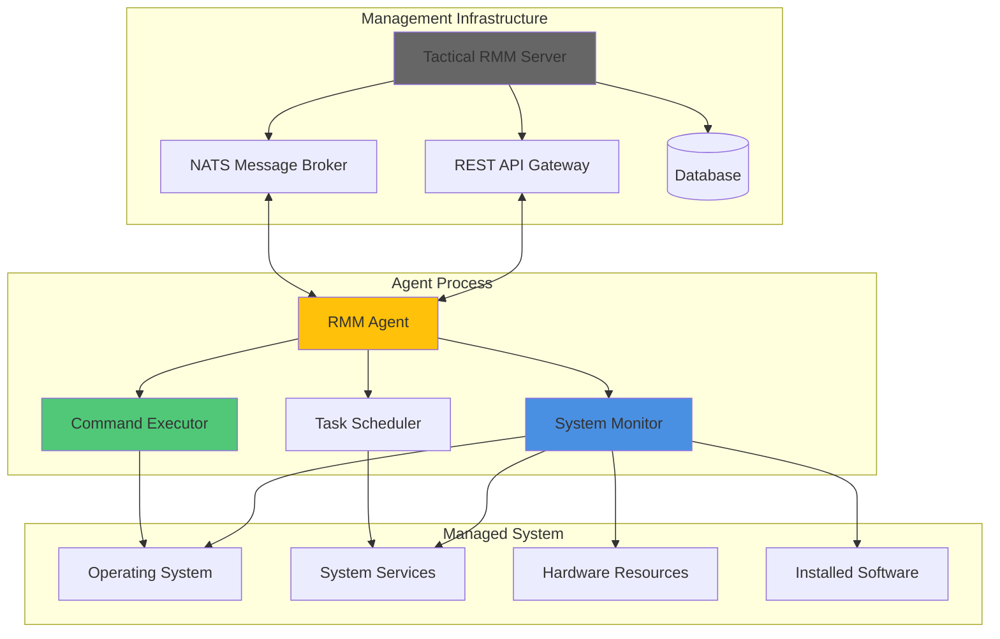

# Introduction to Tactical RMM Agent

The Tactical RMM Agent is a powerful, cross-platform remote monitoring and management (RMM) agent written in Go that enables enterprise-grade endpoint management across Windows, macOS, and Linux systems. It provides real-time system monitoring, remote command execution, automated patch management, and comprehensive device oversight through secure client-server communication.

## What is Tactical RMM Agent?

The Tactical RMM Agent is the lightweight endpoint component of the Tactical RMM ecosystem that runs on managed devices to:

- **Monitor System Health**: Continuously tracks CPU usage, memory consumption, disk space, and running services
- **Execute Remote Commands**: Safely runs PowerShell, Bash, Python scripts and system commands remotely
- **Manage Software Updates**: Automatically handles Windows Updates, software installations, and patch management
- **Provide Real-time Communication**: Maintains secure NATS-based messaging with the management server
- **Support Multiple Platforms**: Native support for Windows, macOS, and Linux with platform-specific optimizations

## Key Features and Benefits

### 🔍 **Comprehensive Monitoring**
- Real-time system metrics collection
- Process and service monitoring
- Disk space and hardware inventory
- Network connectivity checks
- Custom health check execution

### 🚀 **Remote Management**
- Secure remote command execution
- Script deployment and execution (PowerShell, Bash, Python)
- Service start/stop/restart operations
- Scheduled task creation and management
- File transfer and deployment

### 🔐 **Enterprise Security**
- Token-based authentication with automatic refresh
- Encrypted communication channels
- Secure credential management
- OpenFrame integration for enhanced security

### 📊 **Flexible Architecture**
- Service-oriented design with concurrent operations
- Event-driven check-in system (35-120 second intervals)
- Configurable logging and monitoring
- Cross-platform binary distribution

### 🔧 **Easy Deployment**
- Single binary installation
- Command-line configuration
- Service integration on all platforms
- Silent installation support

## Target Audience

This agent is designed for:

- **IT Administrators** managing distributed device fleets
- **MSPs (Managed Service Providers)** requiring scalable endpoint management
- **System Engineers** implementing monitoring and automation
- **DevOps Teams** needing cross-platform system oversight
- **Enterprise IT Departments** seeking comprehensive RMM solutions

## System Architecture Overview

## Core Components at a Glance

| Component | Responsibility |
|-----------|----------------|
| **Agent Core** | Main service process, configuration management, platform abstraction |
| **Check-in Manager** | Periodic system status reporting and task synchronization |
| **RPC Handler** | NATS message processing and remote command execution |
| **System Monitor** | Real-time collection of system metrics and health data |
| **Task Scheduler** | Automated execution of maintenance and monitoring tasks |
| **OpenFrame Integration** | Enhanced security and token management for enterprise deployments |

## Quick Start Overview

Getting started with the Tactical RMM Agent involves three main steps:

1. **Prerequisites**: Ensure your system meets the requirements and you have the necessary server information
2. **Installation**: Download and install the agent binary with your server configuration
3. **Verification**: Confirm the agent is running and communicating with your Tactical RMM server

## What's Next?

After reading this introduction, explore the following guides:

- **[Prerequisites](prerequisites.md)** - System requirements and preparation steps
- **[Quick Start Guide](quick-start.md)** - 5-minute installation and setup
- **[First Steps](first-steps.md)** - Initial configuration and feature exploration

## Project Information

- **Language**: Go 1.20+
- **License**: Tactical RMM License Version 1.0
- **Platforms**: Windows, macOS, Linux (amd64, 386, arm64)
- **Current Version**: 2.9.0
- **Repository**: github.com/amidaware/rmmagent

The Tactical RMM Agent represents a modern approach to endpoint management, combining the performance and reliability of Go with comprehensive cross-platform system integration capabilities.